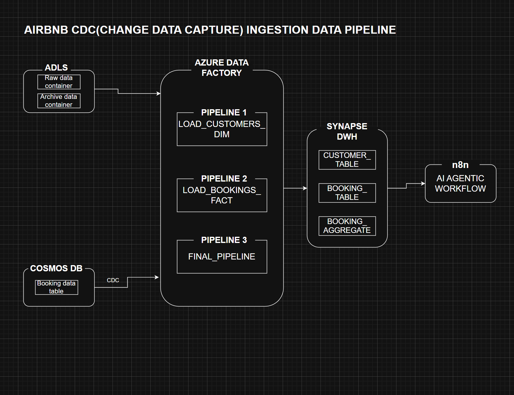

# AirBnB CDC & AI-Powered Ingestion Pipeline

This is an end-to-end, event-driven data platform on Azure that turns real-time data into AI-driven actions.

> 🚧 **Project Status: Work in Progress** 🚧
> I am actively building this project. This repository will be updated day-by-day to showcase the development process.

---

## 🗺️ Day 1: The Architectural Blueprint

As the first step, I have designed the complete high-level architecture for the data pipeline, from ingestion to intelligent action.

---

## Project Goal
This project demonstrates a complete, event-driven loop: it ingests customer booking data in real-time, feeds it to an AI agent, and automatically sends a personalized booking status acknowledgement right back to the customer.

---

### Day 2: Cloud Infrastructure Setup
Detailed the setup and rationale for our core services: ADLS Gen2, Cosmos DB, and Synapse Analytics.
* **[Click here to see the Service Setup & Rationale](./docs/day-2-setup.md)**

### Day 3: DWH Build & ADF Connections
Created the star-schema tables, high-performance aggregation layer, and all ADF Linked Services.
* **[Click here to see the DWH scripts](./docs/day-3-build.md)**

### Day 4: Mock Data Generation (TDD)
Documented the Test-Driven Development (TDD) approach, explaining the "why" and "how" of generating mock data for both batch (SCD) and real-time (CDC) pipelines.
* **[Click here to see the Mock Data Rationale](./docs/day-4-mock-data.md)**

### Day 5: Synapse DWH Build & SQL Rationale
Committed the foundational SQL script for building the DWH and documented the "why" behind its idempotent and performance-optimized (ELT) design.
* **[Click here to see the Synapse SQL Rationale](./docs/day-5-synapse-build.md)**
* **[Click here to see the SQL Build Script](./sql_queries/synapse_table_creation.sql)**

### Day 6: ADF "Password-less" Auth
Committed the SQL script to "whitelist" the ADF Managed Identity in Synapse and documented this critical, secure authentication pattern.
* **[Click here to see the ADF Auth Rationale](./docs/day-6-auth.md)**
* **[Click here to see the ADF Permissions Script](./sql_queries/grant_adf_permissions.sql)**

### Day 7: Pipeline 1 - Batch Customer Load
Built the resilient, metadata-driven ADF pipeline for batch customer data (SCD Type-1) with audit logging and idempotent file handling.
* **[Click here to see the Pipeline 1 Build & Rationale](./docs/day-7-pipeline-1-build.md)**